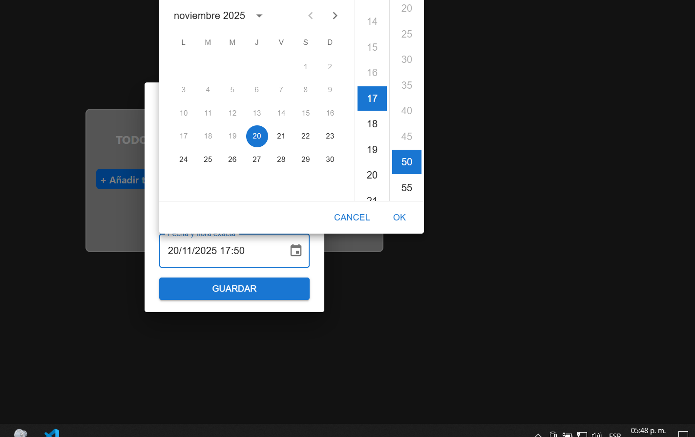
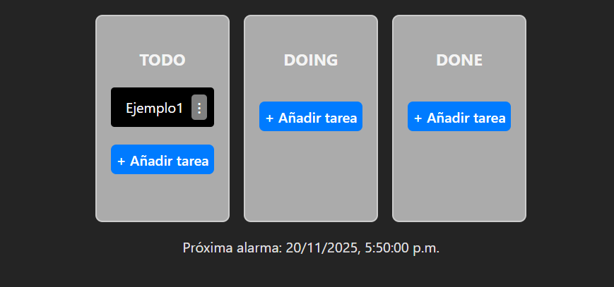
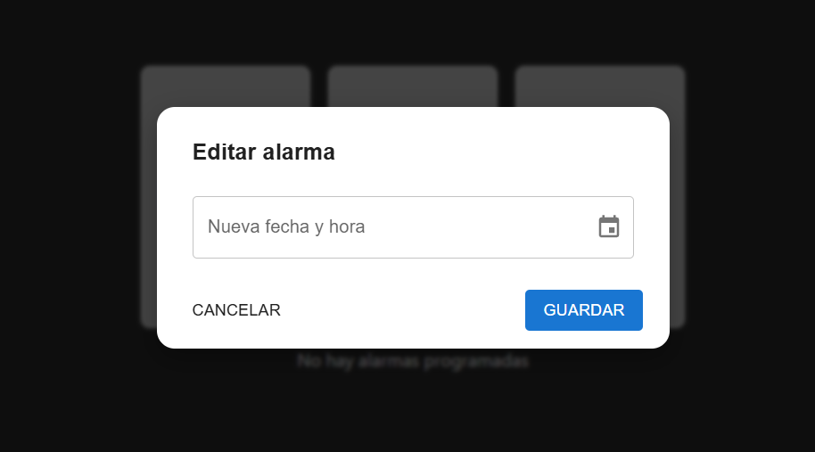

```
public/
└─ Timbre.mp3 # sonido que usa la alarma

src/
├─ assets/
│ └─ screenshots/ # capturas
│
├─ componentes/
│ ├─ AlarmList.jsx
│ ├─ AlarmModal.jsx
│ ├─ AlarmSnackbar.jsx
│ ├─ DragComponent.jsx
│ ├─ KanbanDndKit.jsx
│ ├─ TaskForm.jsx
│ ├─ TaskManager.jsx
│
├─ hooks/
│ ├─ useAlarms.js
│ ├─ useAlarmWatcher.js
│
├─ kanbanBackEnd/
│ ├─ config/db.js
│ ├─ models/Task.js
│ ├─ routes/tasks.js
│ ├─ server.js
│
├─ services/
│ ├─ tasksService.js
│
├─ utils/
│ └─ timeRemaining.js
│
├─ App.jsx
├─ main.jsx
└─ index.css
```

📌 Focus Kanban

   Un Kanban con Modo Foco y Alarmas Inteligentes

   Focus Kanban es una aplicación pensada para ayudarte a organizar tareas, mantenerte enfocado y recibir alertas inteligentes cuando una tarea necesita atención.
   Es como un Focus Mode integrado dentro del Kanban, ideal para trabajo, estudio o proyectos personales.

🚀 Características principales

   ✔️ Kanban simple y funcional (To Do → Doing → Done)

   ✔️ Modo Foco: resalta la tarea actual para evitar distracciones

   ✔️ Alarmas inteligentes que te avisan cuando una tarea vence

   ✔️ Persistencia en MongoDB

   ✔️ Frontend en React + Vite (rápido y modular)

   ✔️ Backend con Node + Express

🛠️ Tecnologías utilizadas

   Frontend

   React

   Vite

   JavaScript

   CSS (sin Tailwind)

Backend

   Node.js

   Express

   MongoDB

   CvdMongoDB 

Extras

   Hooks personalizados 

   Sonido de alarma .mp3

   Manejo básico de estados y efectos


📸 Capturas de pantalla

   Las siguientes imágenes muestran el flujo completo del programa.

   
   
   
   
   
   
   


## 🖥️ **Cómo ejecutar el proyecto en local**

### 1️⃣ Requisitos previos

Debes tener instalado:

- Node.js (v16+)
- MongoDB **local** o **Atlas**
- npm

---

## 2️⃣ Clonar el repositorio


git clone https://github.com//focus-kanban.git
cd focus-kanban

Instalar dependencias

🔵 Frontend

```
cd src
npm install
```

🔵 Backend

```
cd kanbanBackEnd
npm install
```

🔥 Backend

```
cd src/kanbanBackEnd
node server.js
```

Por defecto corre en:
http://localhost:4000

🔥 Frontend

```
cd src
npm run dev
```

Por defecto:
http://localhost:5173


🧠 Motivación

   Los Kanban tradicionales no incluyen alarmas, lo que hace que olvides tareas importantes.
   Focus Kanban soluciona esto agregando:

   Recordatorios visuales

   Sonido de alarma

   Un mini “modo enfoque” integrado a tu flujo

Autor

   Proyecto desarrollado por José Vargas Romero
   Con el objetivo de aprender: Manejo avanzado de estado en React,Drag and Drop con DnDKit,Persistencia con MongoDB,Hooks personalizados,Sistema de notificaciones y alarmas.


